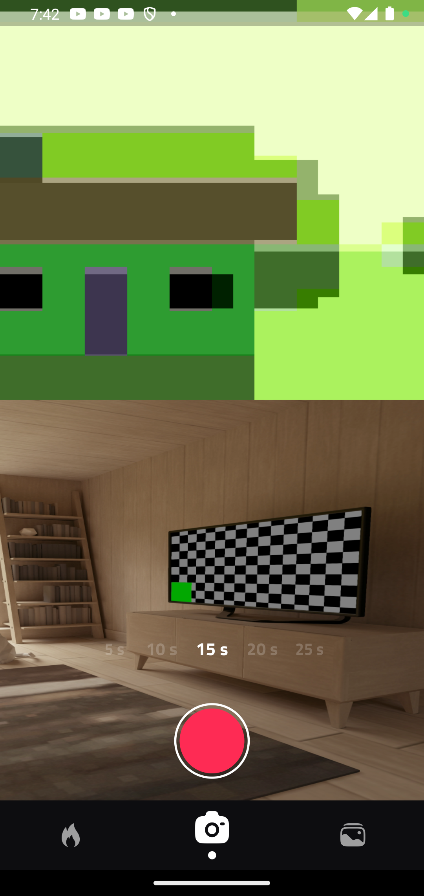
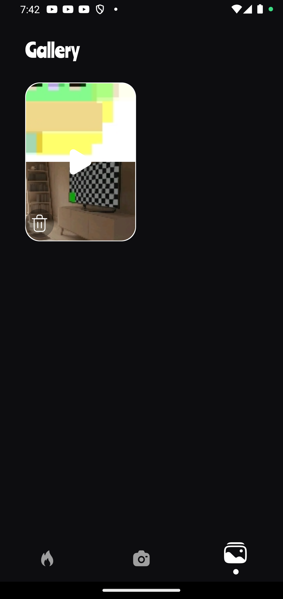

# 🎥 SplitView Camera App (Flutter + Native Android)

> ⚠️ **Note:** Some Android devices **do not support dual camera preview/recording**. This functionality depends on OEM hardware and camera HAL (Hardware Abstraction Layer) support. If you're testing this on an emulator or a single-camera phone, the split camera view will **not work**.

---

## 📱 Recommended Devices for Split Camera Preview

The split camera view feature (Tab 2) is fully supported on devices with proper dual camera concurrency support. These include:

- ✅ **Samsung Galaxy S21 / S22 / S23 series**
- ✅ **Samsung Galaxy Note 20 Ultra**
- ✅ **Pixel 4 and newer**
- ✅ **OnePlus 8 / 9 / 10 series**
- ✅ Some recent Xiaomi, Oppo, and Vivo phones

> ⚠️ **Not supported:** Most emulators, budget or mid-range phones, and older devices.

---

## 🔍 Overview

This Flutter project showcases **multi-tabbed camera interactions**, where:

- **Tab 1:** This is the feeds page that displays scraped data from jelly.com/feeds page. 
- **Tab 2:** Split-screen dual camera recording (Front & Back)
- **Tab 3:** Gallery page to display the recorded splitviews over time 

Each session records and saves **two separate video files** (front and back) with matching timestamps, shown neatly in the Gallery tab.

---

## 🎯 Tab 2 – Dual Camera Split View (Front + Back)

### 💡 Thought Process

The goal for this tab was to:

- Display both front and back camera previews **vertically stacked**
- Record both camera feeds **simultaneously**
- Save each feed individually with synchronized filenames
- Enable deletion, playback, and management via a Flutter UI

This required:
- Using a custom native Android `PlatformView` (`TextureView`-based)
- Managing both camera instances using `Camera2` and `MediaRecorder`
- Handling permission flow manually
- Exchanging control signals between Dart ↔ Kotlin via `MethodChannel`

---

### 🧩 Technical Architecture

#### 📲 Flutter Side:
- Widget `SplitCameraView` displays the split preview
- Button call native `startRecording` and coundown calls `stopRecording` via `MethodChannel`
- Gallery loads video files using `SplitVideoItem` model + service
- Videos are matched using timestamp in filenames

#### 🤖 Native Android Side (Kotlin):
- Custom `SplitCameraView` renders two `TextureView`s in a vertical `LinearLayout`
- `SplitCameraController` handles:
    - Opening front and back cameras
    - Starting and stopping `MediaRecorder`
    - Managing file output
    - Releasing resources on stop/dispose
- Files are named like:
    - `SplitCam_20250714_232444_Front.mp4`
    - `SplitCam_20250714_232444_Back.mp4`

#### 🗂️ Storage:
Saved under:
```
/storage/emulated/0/Android/data/com.adeyemi.jellyapp/files/Movies/
```

---

### 🧹 Gallery Clean-Up Behavior

- Files < 1KB or with invalid duration are automatically skipped
- The app uses `video_player` to validate if each file is playable
- Users can delete both files for a session with a single tap

---

## 🖼 UI Screenshots

| Split Camera View                                     | Gallery Page |
|-------------------------------------------------------|--------------|
|  |  |

---

## 📦 APK Download

> 🔗 [Download APK Here](https://drive.google.com/file/d/11DLVccoI4Ona8fAGITX66YbCJyovbvjY/view?usp=sharing)

---

## 🛠 Setup Instructions

### ✅ Permissions Required

Make sure the app requests and receives:

- 📷 `CAMERA`
- 🎙 `RECORD_AUDIO`
- 💾 `WRITE_EXTERNAL_STORAGE` *(for Android < 10)*
- 📂 `MANAGE_EXTERNAL_STORAGE` *(for Android 11+ if applicable)*

You may need to approve manually from:
```
Settings > Apps > YourApp > Permissions
```

---

### 🔧 How to Run

#### 🧪 On Emulator:
❌ Not supported for split camera (Tab 2)  
✅ Can be used for Tab 1 and Tab 3

#### ✅ On Physical Device:

1. Connect your Android phone with USB debugging enabled.
2. Run:
```bash
flutter pub get
flutter run
```

---

## 🗃 File Structure

| File/Folder | Purpose |
|-------------|---------|
| `lib/views/screens/pages/splitCameraView.dart` | UI for Tab 2 (Split Preview & Recording) |
| `lib/models/split_video_item.dart` | Model for paired recordings |
| `lib/services/split_video_service.dart` | File matching, validation, and deletion |
| `lib/views/screens/pages/gallerypage.dart` | Gallery UI to preview/delete sessions |
| `android/app/src/main/kotlin/.../SplitCameraController.kt` | Handles native camera and recording logic |
| `android/app/src/main/kotlin/.../SplitCameraView.kt` | Renders dual camera preview |
| `MainActivity.kt` | Registers platform view and handles Dart↔Native channels |

---

## 🧩 Tabs Overview

### ▶️ Tab 1: Feeds
1. Scraped splitview videos from jellyjelly.com/feed are displayed here
2. This view features a pageview that enables vertical scrolling between videos.
3. Username, video & description, controls and other UI elements are displayed upon scrolling each video.
4. No method channel to Android was called in this tab.

---

### 🎥 Tab 2: Dual Camera Split View
See full details above.

---

### ▶️ Tab 3: [Insert Explanation Here]
1. Split videos generated from tab 2 are displayed here in a grid.
2. User clicks any item to open the splitvideo.
3. user can delete the split video from this page

---

## 🧪 Debugging Notes

- If files appear but **cannot be played**, they may be:
    - Incomplete recordings (stop failed)
    - Corrupted `MediaRecorder` sessions
- App filters such cases based on:
    - File size
    - `video_player` duration check
- Native code cleans up if `start()` or `stop()` fails

---

## 🤝 Contributions

Feel free to fork, suggest improvements, or raise issues. PRs are welcome.
